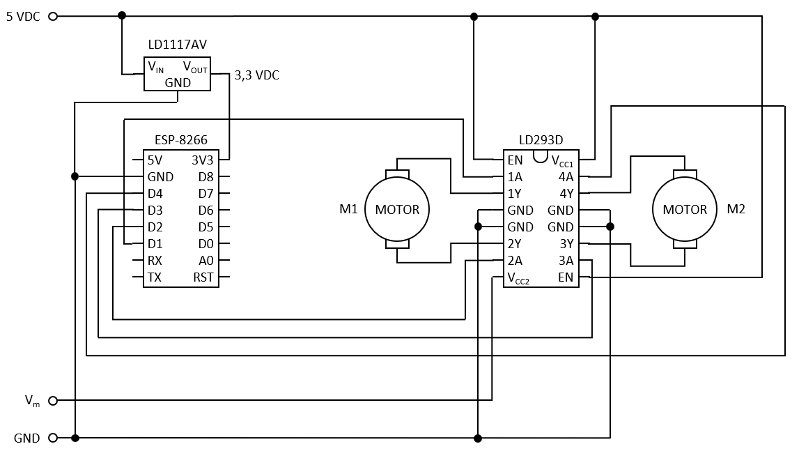

# ESP-8266 Motor Control via Wi-Fi

## Presentation

In this project, you will learn how to control two DC motors using the ESP-8266 via WiFi. Commands can be sent fron a web browser to a web server running on the ESP-8266.

## How It Works

We use digital outputs D5, D6, D7 and D8 to drive the 2 DC motors. Each output produces 3,3 volts and drives one of the four half-H drivers (LD293D). These drivers are able to switch higher power: from 4,5 V to 36 V and up to 600 mA. A small voltage regulator (LD1117AV33) provides a stable 3,3 V to the ESP-8266 from the batteries.

The half-H drivers (LD293D) has two input voltages: 

* Vcc1: Power to run the integrated circuit (5 V)
* Vcc2: Power sent to the motors (4,5 V to 36 V)

In this circuit, we use a pair of half-H drivers for each motor. By this way, we can command the DC motor in both directions (backward and forward). The LD293D has integrated high-speed clamp diodes to suppress inductive transient current from the motors.

The ESP-8266 connects to your Wi-Fi network and a web server provides a web application and accepts commands.


## Material

No | Qty | Description | Manufacturer | P/N
---|-----|-----------|--------------|------------
1 | 1 | ESP-8266 microcontroller | WeMos | D1 Mini V2.3.0
2 | 1 | Voltage regulator 3,3V | STMicroelectronics | LD1117AV33
3 | 1 | Quad half-H driver | Texas Instruments | LD293D
4 | 1 | DIP IC socket 16 pins | --- | ---
5 | 1 | Solderable breadboard | BusBoard Prototype Systems | SB5
6 | 2 | Screw terminal 4 pins | --- | ---
7 | 2 | DC motor 4,5V | LEGO | 107
8 | 2 | Battery holder 3 x AA | --- | ---

## Circuit

This circuit diagram shows the connection between the ESP-8266 and quadruple half-H driver:



## Code

```
/*
 * Copyright 2020 Richard Ng-Jobidon
 *
 * Licensed under the Apache License, Version 2.0 (the "License");
 * you may not use this file except in compliance with the License.
 * You may obtain a copy of the License at
 *
 *     http://www.apache.org/licenses/LICENSE-2.0
 *
 * Unless required by applicable law or agreed to in writing, software
 * distributed under the License is distributed on an "AS IS" BASIS,
 * WITHOUT WARRANTIES OR CONDITIONS OF ANY KIND, either express or implied.
 * See the License for the specific language governing permissions and
 * limitations under the License.
 */
 
#include <ESP8266WiFi.h>

// Constants
const char* WIFI_SSID = "your-wifi-name";
const char* WIFI_PASSWORD = "your-password";
const long TIMEOUT = 2000; // Define timeout time in milliseconds

// Global variables
WiFiServer server(80);     // Set web server port number to 80

// Connect device to Wi-Fi network
void connectWiFi() {

  // Local variables
  bool led_blink = false; // LED blinking state (on/off)

  // Init Wi-Fi
  Serial.println();
  Serial.print("Connecting to ");
  Serial.println(WIFI_SSID);
  WiFi.begin(WIFI_SSID, WIFI_PASSWORD);

  // Wait for Wi-Fi connection
  while (WiFi.status() != WL_CONNECTED) {
    delay(700);
    Serial.print(".");

    // Blink LED
    digitalWrite(BUILTIN_LED, led_blink ? HIGH : LOW);    
    led_blink = !led_blink;
  }

  // Turn off LED
  digitalWrite(BUILTIN_LED, LOW);
  Serial.println("");
  Serial.println("WiFi connected");
  Serial.println("IP address: ");
  Serial.println(WiFi.localIP());  
}

// Setup code to run once
void setup() 
{

  // Init serial monitor
  Serial.begin(115200);
  Serial.println();
  Serial.println("ESP32660 Motor Control v1.00");

  // Set pin ouput mode
  pinMode(BUILTIN_LED, OUTPUT);
  pinMode(D5, OUTPUT);
  pinMode(D6, OUTPUT);
  pinMode(D7, OUTPUT);
  pinMode(D8, OUTPUT);

  // Turn all motors off
  digitalWrite(D5, 0);
  digitalWrite(D6, 0);
  digitalWrite(D7, 0);
  digitalWrite(D8, 0);
  
  // Connect device to Wi-Fi 
  connectWiFi();

  // Startup web server
  server.begin();
  
}

/**
 * Handle client request
 * 
 * @param WiFiClient client     
 * @param String http_header    HTTP header, first line is "HTTP/1.1 200 OK"
 */
void handleClientRequest(WiFiClient client, String http_header) {
  
  // Determine method and resource
  if (http_header.indexOf("GET / ") >= 0) {
    // Return index HTML page
    Serial.println("Index");
    outputIndexHTML(client);
  }
  else {
    if (http_header.indexOf("GET /n ") >= 0) {
      Serial.println("Forward");
      digitalWrite(D5, HIGH);
      digitalWrite(D6, LOW);
      digitalWrite(D7, HIGH);
      digitalWrite(D8, LOW);
    } else if (http_header.indexOf("GET /s ") >= 0) {
      Serial.println("Backward");
      digitalWrite(D5, LOW);
      digitalWrite(D6, HIGH);
      digitalWrite(D7, LOW);
      digitalWrite(D8, HIGH);
    } else if (http_header.indexOf("GET /nw") >= 0) {
      Serial.println("NW");
      digitalWrite(D5, LOW);
      digitalWrite(D6, LOW);
      digitalWrite(D7, HIGH);
      digitalWrite(D8, LOW);
    } else if (http_header.indexOf("GET /ne") >= 0) {
      Serial.println("NE");
      digitalWrite(D5, HIGH);
      digitalWrite(D6, LOW);
      digitalWrite(D7, LOW);
      digitalWrite(D8, LOW);
    } else if (http_header.indexOf("GET /w") >= 0) {
      Serial.println("Left");
      digitalWrite(D5, LOW);
      digitalWrite(D6, HIGH);
      digitalWrite(D7, HIGH);
      digitalWrite(D8, LOW);
    } else if (http_header.indexOf("GET /off") >= 0) {
      Serial.println("Off");
      digitalWrite(D5, LOW);
      digitalWrite(D6, LOW);
      digitalWrite(D7, LOW);
      digitalWrite(D8, LOW);
    } else if (http_header.indexOf("GET /e") >= 0) {
      Serial.println("Right");
      digitalWrite(D5, HIGH);
      digitalWrite(D6, LOW);
      digitalWrite(D7, LOW);
      digitalWrite(D8, HIGH);
    } else if (http_header.indexOf("GET /sw") >= 0) {
      Serial.println("SW");
      digitalWrite(D5, LOW);
      digitalWrite(D6, HIGH);
      digitalWrite(D7, LOW);
      digitalWrite(D8, LOW);
    } else if (http_header.indexOf("GET /se") >= 0) {
      Serial.println("SE");
      digitalWrite(D5, LOW);
      digitalWrite(D6, LOW);
      digitalWrite(D7, LOW);
      digitalWrite(D8, HIGH);
    }
    
    // Return success
    outputSuccessHTML(client);
  }
}

/**
 * Output index HTML page
 * 
 * @param WiFiClient client     
  */
void outputIndexHTML(WiFiClient client) {
  client.println("HTTP/1.1 200 OK");
  client.println("Content-type:text/html");
  client.println("Connection: close");
  client.println();
  client.println("<!DOCTYPE html>");
  client.println("<html><head><meta http-equiv=\"Content-Type\" content=\"text/html; charset=windows-1252\">");
  client.println("<meta name=\"viewport\" content=\"width=device-width, initial-scale=1, maximum-scale=1, user-scalable=0\">");
  client.println("<title>ESP8266 Motor Control</title>");
  client.println("<style>");
  client.println("  html { overflow:hidden; position:fixed; }");
  client.println("  html, body { height:100%; width:100%; margin:0px; }");
  client.println("  body { font-family: Helvetica; text-align:center; background-color:#008000; overflow:auto; }");
  client.println("  .d1 { display:table; width: 100%; height:33.3333333333%; }");
  client.println("  .d2 { display:table-row; width:100%; height:100%; }");
  client.println("  .d3 { display:table-cell; width:33%; height:100%; float: none; padding:0; vertical-align:middle; }");
  client.println("  .d4 { position: relative; height:100%; vertical-align:middle; }");
  client.println("  .d5 { position: absolute; height:100%; right:0; bottom:0; left:0; background-color:#008000; margin-top:40%; }");
  client.println("  .d5, .d5::after { display:inline-block; vertical-align:middle; }");
  client.println("  .d5::after { content:""; height:100%; }");
  client.println("  .stop { background-color:#800000; }");
  client.println("  a, a:visited { font-size:5vw; color:white; text-decoration:none; }");
  client.println("  a:hover div { background-color:#00CC00; }");
  client.println("  a:hover .stop { background-color:#CC0000; }");
  client.println("</style>");
  client.println("<script>");
  client.println("  function callServer(str) {");
  client.println("    var xhr = new XMLHttpRequest();");
  client.println("    xhr.onreadystatechange = function() {};");
  client.println("    xhr.open('GET', str);");
  client.println("    xhr.send();");
  client.println("  }");
  client.println("</script>");
  client.println("</head>");
  client.println("<div class=\"d1\">");
  client.println("  <div class=\"d2\">");
  client.println("    <div class=\"d3\">");
  client.println("      <div class=\"d4\">");
  client.println("      <a href=\"#\" onclick=\"callServer('nw');return false;\">");
  client.println("      <div class=\"d5\">");
  client.println("      <br>&#8598;");
  client.println("      </div>");
  client.println("      </a>");
  client.println("      </div>");
  client.println("    </div>");
  client.println("    <div class=\"d3\">");
  client.println("      <div class=\"d4\">");
  client.println("      <a href=\"#\" onclick=\"callServer('n');return false;\">");
  client.println("      <div class=\"d5\">");
  client.println("      <br>&#8593;");
  client.println("      </div>");
  client.println("      </a>");
  client.println("      </div>");
  client.println("  </div>");
  client.println("  <div class=\"d3\">");
  client.println("    <div class=\"d4\">");
  client.println("      <a href=\"#\" onclick=\"callServer('ne');return false;\">");
  client.println("      <div class=\"d5\">");
  client.println("      <br>&#8599;");
  client.println("      </div>");
  client.println("      </a>");
  client.println("      </div>");
  client.println("    </div>");
  client.println("  </div>");
  client.println("</div>");
  client.println("<div class=\"d1\">");
  client.println("  <div class=\"d2\">");
  client.println("    <div class=\"d3\">");
  client.println("      <div class=\"d4\">");
  client.println("      <a href=\"#\" onclick=\"callServer('w');return false;\">");
  client.println("      <div class=\"d5\">");
  client.println("      <br>&#8592;");
  client.println("      </div>");
  client.println("      </a>");
  client.println("      </div>");
  client.println("  </div>");
  client.println("  <div class=\"d3\">");
  client.println("    <div class=\"d4\">");
  client.println("      <a href=\"#\" onclick=\"callServer('off');return false;\">");
  client.println("      <div class=\"d5 stop\">");
  client.println("      <br>STOP");
  client.println("      </div>");
  client.println("      </a>");
  client.println("      </div>");
  client.println("    </div>");
  client.println("    <div class=\"d3\">");
  client.println("      <div class=\"d4\">");
  client.println("      <a href=\"#\" onclick=\"callServer('e');return false;\">");
  client.println("      <div class=\"d5\">");
  client.println("      <br>&#8594;");
  client.println("      </div>");
  client.println("      </a>");
  client.println("      </div>");
  client.println("    </div>");
  client.println("  </div>");
  client.println("</div>");
  client.println("<div class=\"d1\">");
  client.println("  <div class=\"d2\">");
  client.println("    <div class=\"d3\">");
  client.println("      <div class=\"d4\">");
  client.println("      <a href=\"#\" onclick=\"callServer('sw');return false;\">");
  client.println("      <div class=\"d5\">");
  client.println("      <br>&#8601;");
  client.println("      </div>");
  client.println("      </a>");
  client.println("    </div>");
  client.println("  </div>");
  client.println("  <div class=\"d3\">");
  client.println("    <div class=\"d4\">");
  client.println("      <a href=\"#\" onclick=\"callServer('s');return false;\">");
  client.println("      <div class=\"d5\">");
  client.println("      <br>&#8595;");
  client.println("      </div>");
  client.println("      </a>");
  client.println("    </div>");
  client.println("  </div>");
  client.println("  <div class=\"d3\">");
  client.println("    <div class=\"d4\">");
  client.println("      <a href=\"#\" onclick=\"callServer('se');return false;\">");
  client.println("      <div class=\"d5\">");
  client.println("      <br>&#8600;");
  client.println("      </div>");
  client.println("      </a>");
  client.println("      </div>");
  client.println("    </div>");
  client.println("  </div>");
  client.println("</div>");
  client.println("</body>");
  client.println("</html>");
}

/**
 * Output success HTML page
 * 
 * @param WiFiClient client     
 */
void outputSuccessHTML(WiFiClient client) {
  client.println("HTTP/1.1 200 OK");
  client.println("Content-type:text/html");
  client.println("Connection: close");
  client.println();
  client.println("<!DOCTYPE html>");
  client.println("<body>");
  client.println("<h1>OK</h1>");
  client.println("</body>");
  client.println("</html>");
}

// Main code to run repeatedly
void loop() 
{
  // Local variables
  String http_header; // Variable to store the HTTP request
  unsigned long currentTime = 0;   // Current time
  unsigned long previousTime = 0;  // Previous time
  
  // Waiting client
  WiFiClient client = server.available();
  if (client) { 
    Serial.println("New client");
    String currentLine = "";
    currentTime = millis();
    previousTime = currentTime;

    // Read HTTP request
    while (client.connected() && currentTime - previousTime <= TIMEOUT) { 
      currentTime = millis();         
      if (client.available()) {  // Data available
        char c = client.read();  // Read one character
        Serial.write(c);
        http_header += c;
        // New line character
        if (c == '\n') {
          // Empty line marks the end of HTTP request
          if (currentLine.length() == 0) {
            
            // Handle client request
            handleClientRequest(client, http_header);

            // Break out of the while loop
            break;
          } else { // if you got a newline, then clear currentLine
            currentLine = "";
          }
        } else if (c != '\r') {  
          // Add character to current line
          currentLine += c;
        }
      }
    }
    
    // Close connection
    client.stop();
    Serial.println("Client disconnected.");
    Serial.println("");
  }
}
```
